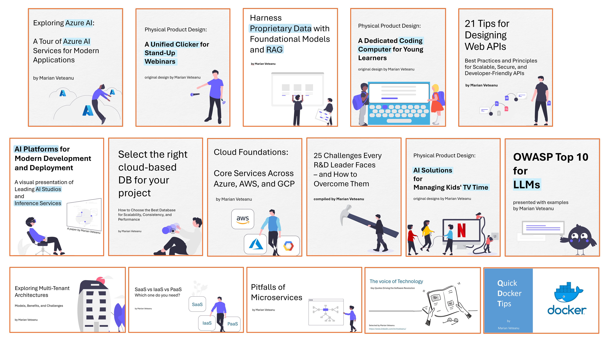

# Technology Related Papers 
## by Marian Veteanu

📢 Excited to join an organization where I can make an impact! Let’s **connect** and explore opportunities — **message me on LinkedIn**: https://www.linkedin.com/in/mveteanu/

---

## AI/LLM
- Harness Proprietary Data with Foundational Models and RAG: [rag.pdf](https://github.com/mveteanu/techpapers/blob/main/rag.pdf)
- A visual presentation of Leading AI Studios: [ai_studios.pdf](https://github.com/mveteanu/techpapers/blob/main/ai_studios.pdf)
- A Tour of Azure AI Services: [azure_ai.pdf](https://github.com/mveteanu/techpapers/blob/main/azure_ai.pdf)
- OWASP Top 10 for LLMs: [llm_security.pdf](https://github.com/mveteanu/techpapers/blob/main/llm_security.pdf)

## Cloud
- Core Services Across Azure, AWS, and GCP: [cloud_core.pdf](https://github.com/mveteanu/techpapers/blob/main/cloud_core.pdf)
- Select the right cloud-based DB for your project: [cloud_db.pdf](https://github.com/mveteanu/techpapers/blob/main/cloud_db.pdf)
- 21 Tips for Designing Web APIs: [webapis.pdf](https://github.com/mveteanu/techpapers/blob/main/webapis.pdf)

## Leadership
- 25 Challenges Every R&D Leader Faces: [rd_challenges.pdf](https://github.com/mveteanu/techpapers/blob/main/rd_challenges.pdf)

## Physical Product Design
- Power Presenter: An OBS and PowerPoint clicker: [power_presenter.pdf](https://github.com/mveteanu/techpapers/blob/main/power_presenter.pdf)
- Stay Active: An AI solution for controlling TV time: [stay_active.pdf](https://github.com/mveteanu/techpapers/blob/main/stay_active.pdf)
- Coral Micro: A dedicated coding computer: [coral_micro.pdf](https://github.com/mveteanu/techpapers/blob/main/coral_micro.pdf)

## Cloud architecture
- SaaS vs IaaS vs PaaS: [saas_iaas_paas.pdf](https://github.com/mveteanu/techpapers/blob/main/saas_iaas_paas.pdf)
- Exploring Multi-Tenant Architectures: [multitenant_architectures.pdf](https://github.com/mveteanu/techpapers/blob/main/multitenant_architectures.pdf)
- Pitfalls of Microservices: [pitfalls_microservices.pdf](https://github.com/mveteanu/techpapers/blob/main/pitfalls_microservices.pdf)
- Docker Tips: [docker_tips.pdf](https://github.com/mveteanu/techpapers/blob/main/docker_tips.pdf)

## Industry quotes
- Key Quotes Driving the Software Revolution: [quotes.pdf](https://github.com/mveteanu/techpapers/blob/main/quotes.pdf)

Happy Coding!
